<div align="center">
  
  <!-- dynamic typing effect 动态打字效果 -->
  <div align="center">
    <a href="https://blog.sunguoqi.com/">
      
    </a>
  </div>

  <!-- knock code pictures 敲代码的图片 -->
  <br>

  <!-- profile logo 个人资料徽标 -->
  <div align="center">
    <a href="https://sunsunblog.top/"></a>&emsp;
    <!-- visitor statistics logo 访客数统计徽标 -->
  </div>

  <!-- Snake Code Contribution Map 贪吃蛇代码贡献图 -->
<picture>
  <source media="(prefers-color-scheme: dark)" srcset="https://cdn.jsdelivr.net/gh/sun0225SUN/sun0225SUN/profile-snake-contrib/github-contribution-grid-snake-dark.svg" />
  <source media="(prefers-color-scheme: light)" srcset="https://cdn.jsdelivr.net/gh/sun0225SUN/sun0225SUN/profile-snake-contrib/github-contribution-grid-snake.svg" />
  
</picture>

</div>

#  🙋 Hello

<table>
<tr><td>

<!-- About me 关于我 -->
### 🤺 About Me


<p>&emsp;&emsp;大家好，我是小孙同学。</p>
<p>&emsp;&emsp;热爱编程、摄影、读书、旅行。</p>
<p>&emsp;&emsp;热爱计算机科学和IT互联网事业，励志成为一名优秀的独立开发者。</p>
<p>&emsp;&emsp;我们正在让这个世界变得更加美好，通过代码的重复使用和延展构建完美体系。</p>
<p><strong>&emsp;&emsp;We're making the world a better place. Through constructing elegant hierarchies for maximum code reuse and extensibility.</strong></p>

</td></tr>

<tr>
<td>
  
### 🏢 Work Experience

- [北京融易通信息技术有限公司] &emsp; 📌 2021-05-01 —— Now
  
  - 工作岗位：Web前端开发工程师
  - 工作内容：移动端相关


</td>
</tr>

<tr><td>

### 🤾‍♂️ Funny Soul


<!-- START_SECTION:douban -->
* <a href='https://book.douban.com/subject/35193035/' target='_blank'>最近在读认知觉醒</a> 🌟🌟🌟🌟🌟 力荐- 2023-04-17
* <a href='http://movie.douban.com/subject/1292052/' target='_blank'>看过肖申克的救赎</a> 🌟🌟🌟🌟🌟 力荐- 2023-02-07
* <a href='http://movie.douban.com/subject/1292365/' target='_blank'>看过活着</a> 🌟🌟🌟🌟🌟 力荐- 2023-02-07
* <a href='https://music.douban.com/subject/26567580/' target='_blank'>听过假如爱有天意</a> 🌟🌟🌟🌟🌟 力荐- 2023-02-07
* <a href='http://movie.douban.com/subject/35465232/' target='_blank'>在看狂飙</a> 🌟🌟🌟🌟🌟 力荐- 2023-02-07
<!-- END_SECTION:douban -->

</td></tr>

<tr><td>

<!-- wakatime 统计 -->
### 📊 WakaTime

<picture>
  <source
    srcset="https://github-readme-stats.vercel.app/api/wakatime?username=sun0225SUN&layout=compact&text_color=f0f6fc&bg_color=00000000&hide_border=true&hide_title=true"
    media="(prefers-color-scheme: dark)"
  />
  <source
    srcset="https://github-readme-stats.vercel.app/api/wakatime?username=sun0225SUN&layout=compact&text_color=1f2328&bg_color=00000000&hide_border=true&hide_title=true"
    media="(prefers-color-scheme: light), (prefers-color-scheme: no-preference)"
  />
  
</picture>

</td></tr>

<tr><td>

<!--START_SECTION:waka-->
**I'm a Night 🦉** 

```text
🌞 Morning                274 commits         █████░░░░░░░░░░░░░░░░░░░░   19.34 % 
🌆 Daytime                428 commits         ████████░░░░░░░░░░░░░░░░░   30.20 % 
🌃 Evening                507 commits         █████████░░░░░░░░░░░░░░░░   35.78 % 
🌙 Night                  208 commits         ████░░░░░░░░░░░░░░░░░░░░░   14.68 % 
```
📅 **I'm Most Productive on Friday** 

```text
Monday                   207 commits         ████░░░░░░░░░░░░░░░░░░░░░   14.61 % 
Tuesday                  187 commits         ███░░░░░░░░░░░░░░░░░░░░░░   13.20 % 
Wednesday                188 commits         ███░░░░░░░░░░░░░░░░░░░░░░   13.27 % 
Thursday                 155 commits         ███░░░░░░░░░░░░░░░░░░░░░░   10.94 % 
Friday                   356 commits         ██████░░░░░░░░░░░░░░░░░░░   25.12 % 
Saturday                 147 commits         ███░░░░░░░░░░░░░░░░░░░░░░   10.37 % 
Sunday                   177 commits         ███░░░░░░░░░░░░░░░░░░░░░░   12.49 % 
```


📊 **This Week I Spent My Time On** 

```text
🕑︎ Time Zone: Asia/Shanghai

💬 Programming Languages: 
Markdown                 8 hrs 2 mins        ██████████░░░░░░░░░░░░░░░   40.46 % 
TypeScript               5 hrs 40 mins       ███████░░░░░░░░░░░░░░░░░░   28.57 % 
Vue.js                   2 hrs 11 mins       ███░░░░░░░░░░░░░░░░░░░░░░   10.99 % 
HTML                     1 hr 27 mins        ██░░░░░░░░░░░░░░░░░░░░░░░   07.33 % 
JSON                     52 mins             █░░░░░░░░░░░░░░░░░░░░░░░░   04.38 % 

🔥 Editors: 
VS Code                  19 hrs 52 mins      █████████████████████████   100.00 % 

💻 Operating System: 
Windows                  18 hrs 17 mins      ███████████████████████░░   92.04 % 
Mac                      1 hr 34 mins        ██░░░░░░░░░░░░░░░░░░░░░░░   07.96 % 
```


 Last Updated on 31/07/2023 01:23:48 UTC
<!--END_SECTION:waka-->
  
</td></tr>
</table>

<!-- ########################################## 分割 ########################################## -->


<div align="center" >



<!-- just img 图片 -->


<!--  skill badge 技能徽章 -->

```mermaid
mindmap
  root((小孙同学))
    编程
      Web开发
      网络爬虫
      人工智能
    摄影
      人文
      建筑
      风景
    旅行
      南京
      北京
      芜湖
      合肥
      上海
    阅读
      人物传记
      个人成长
      社会文化
      历史
      计算机技术
```

💪 正在学习


  
🧠 计划学习


🧰 常用的工具


<!-- programming tool icon 编程工具图标 -->
<br>

<!-- svg -->


 


<br>
</div>
